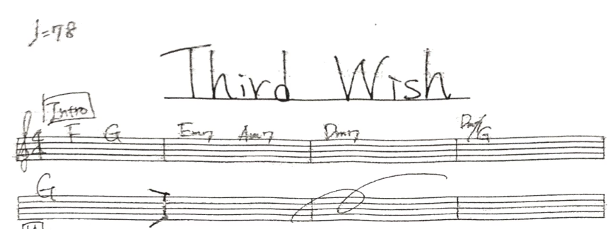

```{r setup, include=FALSE}
knitr::opts_chunk$set(echo = FALSE)
```

## Inspiration

  
## Example: The Moon Song
<audio controls>
<source src="songs/The Moon Song Instrumental.mp3" type="audio/mpeg"></source>
</audio>


## Musical Chords & Keys
- A chord is 3+ musical notes played at the same time
- Chord progression 
- Tranpose chords to the key of C (normalization)


## Dataset: The McGill Billboard Project
- 990 songs of Billboard chart from 1958 to 1991
- Containing txt files of chord annotations, csv file of song info
- Genres of songs obtained by API
  


## EDA: Genre Popularity over Time
```{r}
load("~/Google Drive/Columbia/5243 ADS/ADS Proj 5/Fall2016-proj5-grp2/doc/ioSlides/plots/EDA_plot.RData")
p1
```
  
## EDA: Major Chords of All Genres
```{r}
p2
```

## Naive Bayes
- Predict genres using chord frequencies
- Prediction accuracy: 52%
- Baseline accuracy: 25% (Enhanced by 107%!)
```{r}
load("~/Google Drive/Columbia/5243 ADS/ADS Proj 5/Fall2016-proj5-grp2/doc/ioSlides/plots/NB.RData")
t2
```

## Sequence Analysis: N-gram
- An n-gram is a contiguous sequence of n items from a given sequence of text or speech
- N = 1 (unigram), 2 (bigram), 3 (trigram), 4 (4-gram), ....
- Widely used in NLP, DNA sequencing...

## Sequence Analysis: Bigram
<audio controls>
<source src="songs/Michael Jackson-Beat It.mp3" type="audio/mpeg"></source>
</audio>
<audio controls>
<source src="songs/Beat It (Instrumental Version).mp3" type="audio/mpeg"></source>
</audio> 
<audio controls>
<source src="songs/BeatItChord.wav" type="audio/mpeg"></source>
</audio> 

>- <div class="red2">
Beat It - Michael Jackson
</div>
>- C:min => Bb:maj => C:min => Bj:maj => ... ...
```{r}
load("~/Google Drive/Columbia/5243 ADS/ADS Proj 5/Fall2016-proj5-grp2/doc/ioSlides/plots/BeatIt.RData")
BeatItChord
```

## Chord Diagrams of All Genres

[Click here!](plots/AllChordDiagram.html)

## Sequence Analysis: 4-gram
```{r}
load("~/Google Drive/Columbia/5243 ADS/ADS Proj 5/Fall2016-proj5-grp2/doc/ioSlides/plots/Sankey.Rdata")
Sankey
```

## 4-Gram using tf-idf: R&B genre
```{r}
load("~/Google Drive/Columbia/5243 ADS/ADS Proj 5/Fall2016-proj5-grp2/doc/ioSlides/plots/R&B_Sankey.RData")
RB_Sankey
```

## 4-Gram using tf-idf: Country genre 
```{r}
load("~/Google Drive/Columbia/5243 ADS/ADS Proj 5/Fall2016-proj5-grp2/doc/ioSlides/plots/Country_Sankey.RData")
p
```


## Shiny App: MelodySoup
- Generate a chord progression given a specific genre
- Recommend next chord based on (n-1)-gram
- Rank by tf-idf (term frequency - inverse document frequency)
- [Click here!](plots/AllChordDiagram.html) 

  


