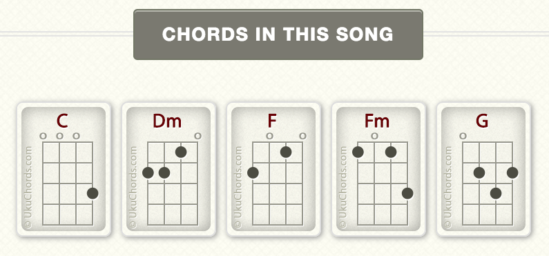
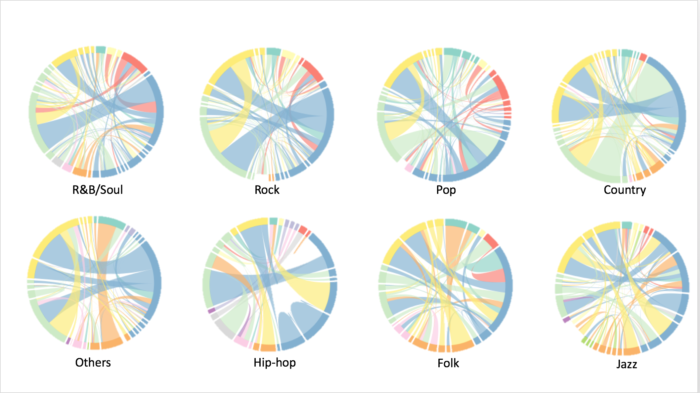

```{r setup, include=FALSE}
knitr::opts_chunk$set(echo = FALSE)
```

##Motivation

  
## Example: The Moon Song
<audio controls>
<source src="www/All_genres.wav" type="audio/mpeg"></source>
</audio>



## Chords & Keys
- A chord is three or more musical notes played at the same time
- Chord progression 
- Normalize chords to the key of C

## Dataset: Billboard


## EDA: Genre Popularity over Time
```{r}
load("~/Google Drive/Columbia/5243 ADS/ADS Proj 5/Fall2016-proj5-grp2/lib/ioSlides/EDA_plot/EDA_plot.RData")
p1
```
  
## EDA: Major Chords of All Genres
```{r}
p2
```

## Naive Bayes
- Classify genres using chords
- Prediction accuracy: 52%
- Baseline accuracy: 25% (Enhanced by 107%!)

## Sequence Analysis: N-gram
- An n-gram is a contiguous sequence of n items from a given sequence of text or speech
- N = 1 (unigram), 2 (bigram), 3 (trigram), 4 (4-gram), ....
- Widely used in NLP, DNA sequencing...

## Chord Sequence Analysis: Bigram
<audio controls>
<source src="www/Michael Jackson-Beat It.mp3" type="audio/mpeg"></source>
</audio>
<audio controls>
<source src="www/BeatItChord.wav" type="audio/mpeg"></source>
</audio> 
>- <div class="red2">
Beat It - Michael Jackson
</div>
>- C:min => Bb:maj => C:min => Bj:maj => ... ...
```{r}
load("~/Google Drive/Columbia/5243 ADS/ADS Proj 5/Fall2016-proj5-grp2/lib/ioSlides/EDA_plot/BeatIt.RData")
BeatItChord
```

## Chord Diagrams of All Genres

EDA_plot/AllChordDiagram.html
[Click here!](EDA_plot/AllChordDiagram.html)

## Chord Sequence Analysis: 4-Gram
```{r}
load("~/Google Drive/Columbia/5243 ADS/ADS Proj 5/Fall2016-proj5-grp2/lib/ioSlides/EDA_plot/Sankey.Rdata")
Sankey
```

## R&B
```{r}
load("~/Google Drive/Columbia/5243 ADS/ADS Proj 5/Fall2016-proj5-grp2/lib/ioSlides/EDA_plot/R&B_Sankey.Rdata")
p
```

## Country
```{r}
load("~/Google Drive/Columbia/5243 ADS/ADS Proj 5/Fall2016-proj5-grp2/lib/ioSlides/EDA_plot/Country_Sankey.Rdata")
p
```


## Shiny App: MelodySoup
- Generate a chord sequence given a specific genre
- Recommend next chord based on previous 3 chords sequence
- Rank by tf-idf (term frequency???inverse document frequency)
- &^%#!(*^(@(#&)#&)!@)!!!!!!!!!!!!!!!!!!!!!!!!!!!!!!


